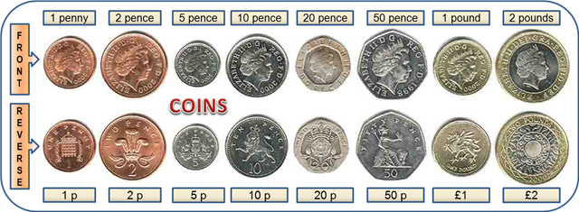

## Coin Machine

### Requirements:

You have to write an algorithm that takes a monetary value, calculates the fewest coins possible to make that change and return a list of how many of each coin is returned
i.e. an input of £2 should return `1 x £2 coin` and an input of £2.53 should return `1 x £2, 1 50p, 1 2p, 1 1p`

The coins in the machine are:



#### Input Format:

If the input starts with a pound symbol ("£") or if the number is a float, the value is in pounds, otherwise consider it as pennies. When the input
is badly formatted the interface can throw an exception or anything suitable for the language you are using.

### Example Test Data:

```
|Input| Output                         |
|£2   | 1 £2                           |
|253  | 1 £2, 1 50p, 1 2p, 1 1p        |
|5.23 | 2 £2, 1 £1, 1 20p, 1 2p, 1 1p  |
|$23  | Throw sensible exception       |
```

### Stretch/Extended Functionality

Start the machine with a state of coins which get consumed as change is given out. This will add restrictions to what coins you have available and will mean you have to give more than the theoretical minimum coins. What will you do when the full change amount can't be given?
